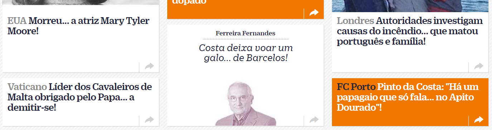

# Tabloidify... your news!

## How do you like your news?

I like mine with ellipses... and exclamation marks!

If you like them that way too, go to your browser, open your news site of choice and paste the following code in your javascript console:

```javascript
document.querySelectorAll("h1, h2, h3").forEach(function (e) { let text = e.innerHTML.trim(); let tabloidText = text.replace(/^(.*) (por|para|de|do|da|no|na|em|à|ao|a|antes|depois|que|quando|onde|como|só|cómo|en) (.*)$/ig, "$1... $2 $3!"); e.innerHTML = tabloidText; })
```

I didn't put more that 10 minutes into that, so don't expect it to work in many sites, at least for now :)

## Examples

### [Diário de Notícias](http://www.dn.pt/)



### [Público](http://www.publico.pt/)


### [El Pais](http://elpais.com/)

